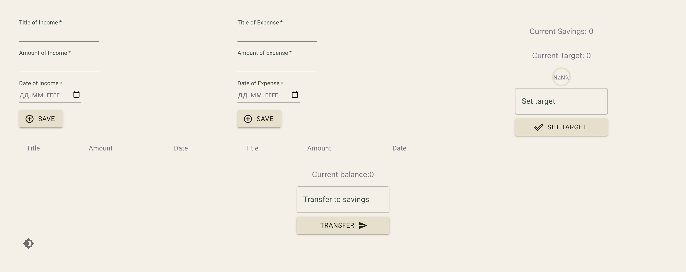
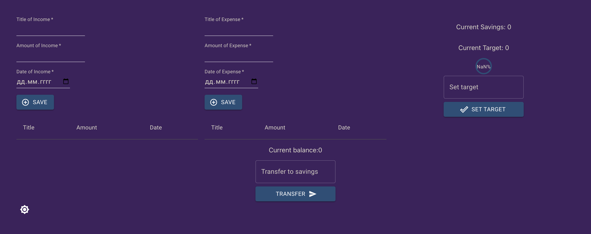
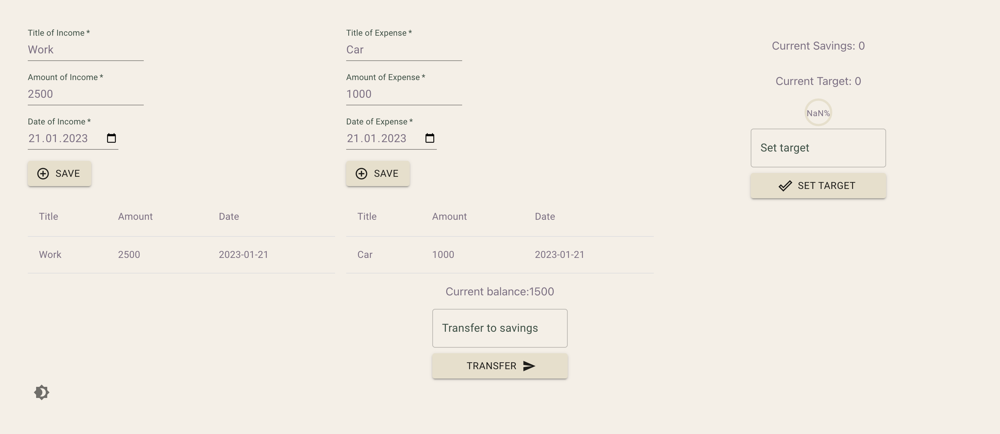
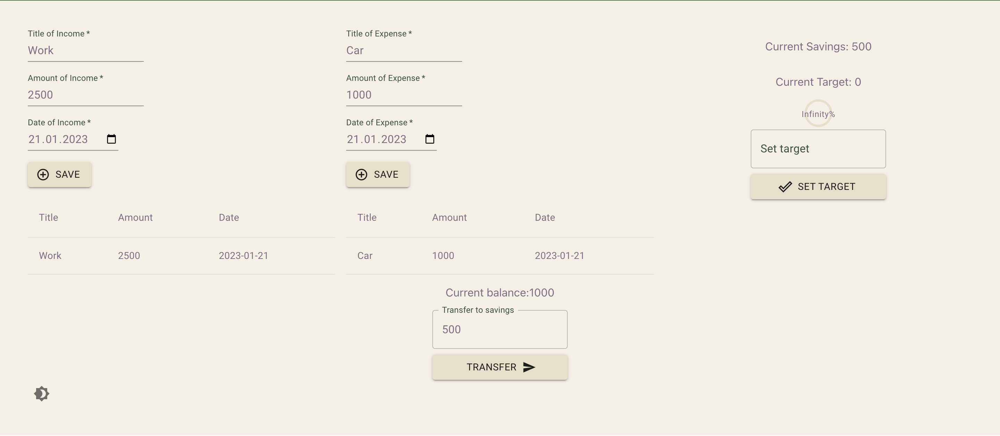
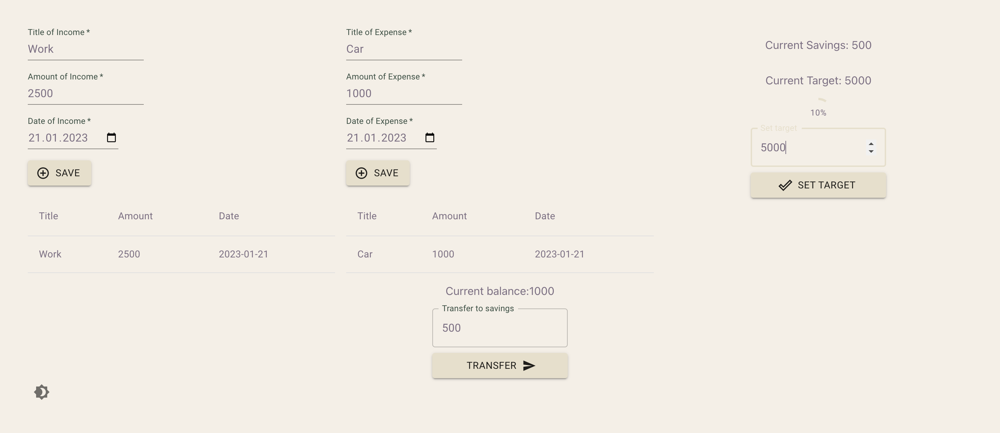

<h1>Budget control app</h1>

A Budget control App allows users to add expenses by name and cost, remove 
expenses, view how much of their budget is remaining, and how much they have
spent so far. While building this project i learned to use Typescript and React. 

 

## Preview:

